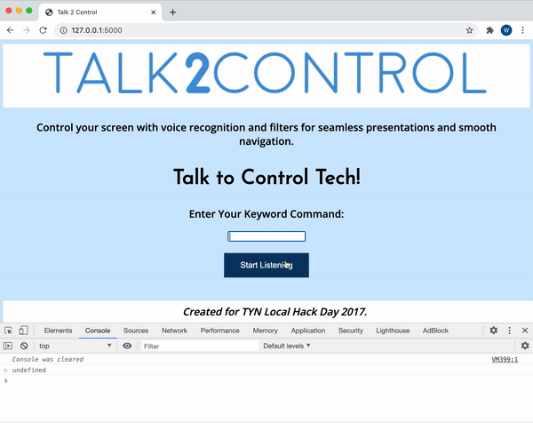

# Talk2Control


Talk to control tech!

Talk2Control is a voice activated keyboard input web application. It allows the user to navigate a slideshow or animation with just their voice, allowing for slides to sync perfectly with them as they speak.

> Note: This is an updated fork from the original repository, which can be found [here](https://github.com/WilliamLQin/talk2control).

## Demo

### [Project Story / Devpost Link](https://devpost.com/software/talk2control-9vzc1s)



## Current State of Project

This project is being revamped in terms of UI and functionality to provide a more fun way of engaging with the application. The original project state can be found in the [original repository](https://github.com/WilliamLQin/talk2control).

Talk2Control currently requires specific conditions to function properly.

## How it works

This application runs a Flask server that performs
key press behaviour using macOS OSAScript and serves the client side webpage that listens to the user's voice via p5.js speech library.

Because the Flask server controls the computer key press locally on the same machine, it is recommended to create a clone of this project and run it on localhost to get it to work.

If you inspect element at the live website, you can still see the output on the console of what the voice recognition library is outputting. When it matches up with your keyword, it will cause a key press on the server.

Currently, the key press is set to the space bar and only works with one keyword. You can modify this behaviour by changing the key code on line 6 of the `app.py` file.

Please note, this project uses OSAScript. Hence, it currently only works on macOS.

## Getting Started

This project uses Flask to run the Python backend code. 
You'll need Python installed on your computer. Head to [Python](https://www.python.org/downloads/) to download it if you don't have it. 

Clone the project and navigate to the directory in the terminal. 

1. Install Flask: `pip install Flask` or `pip3 install Flask`.
2. Set the PATH to the app.py:
    ```
    export FLASK_APP=app.py
    ```
3. whenever you want to run the server on localhost, simply enter:
    ```
    flask run
    ```

If you encounter any issues, please consult the Flask documentation to get it set up. 

## Customization

Changing the key that is pressed when the keyword is identified is easy. 
Open the app.py file in the root directory of the project. 
Modify line 6 of the file:

```
  (key code 49)
```

Switch to a different keycode to press a different button. Go to this [complete list of keycodes](http://eastmanreference.com/complete-list-of-applescript-key-codes/) to find out which keycodes refer to which keys. 

For example...

```
  (key code 124)
```

will press the right key whenever the keyword is heard.

> Note: Currently, you can only map one word to one key.
